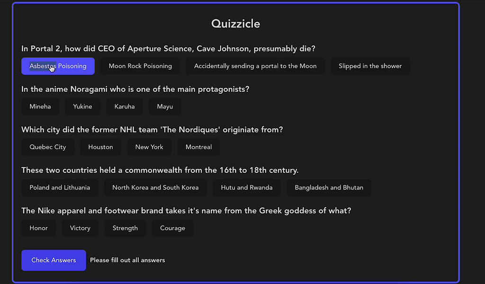

# Quizzicle
This is a quiz game made using react with vite that pulls from the open trivia database.

## How It's Made:

**Tech used:** HTML, CSS, JavaScript, React

This app gets data from the open trivia database and displays the questions and answers into a react component that is then rendered to the screen. It uses javascript to shuffle the asnwer choices to the user and to asses how many questions the user got right, after clicking the button. Then makes a new api call if the user clicks on play again.

## Optimizations

In the future, I would like to add options for the user to select different difficulty, categories, and number of questions.

## Lessons Learned:

This project helped me solidify my react skills even more and learned a lot about passing data between react components and scope. I also learned more about how to use javascript algorithms to do thigns such as shuffle data in an array. I also got a better grasp about making decisions in react such as knowing when and when not to use React.useEffect and useState.

